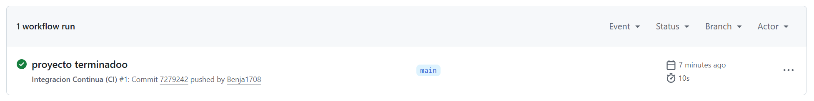
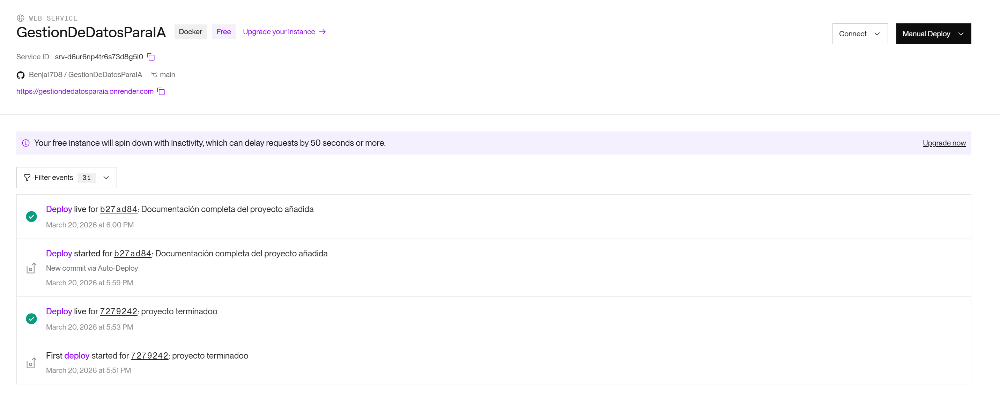
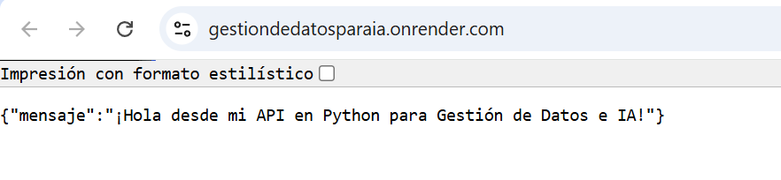

# GestionDeDatosParaIA

GestionDeDatosParaIA 🚀
Este proyecto consiste en la configuración de un entorno técnico profesional diseñado para desarrollar y desplegar soluciones basadas en datos e inteligencia artificial. Implementa prácticas modernas de contenedorización, integración continua (CI) y gestión de entornos en la nube.

🛠️ Tecnologías y Estructura del Proyecto
El repositorio está organizado para ser escalable y reproducible en cualquier servidor que soporte Docker.

1. Aplicación Base (src/)
main.py: Contiene una API básica construida con FastAPI. Funciona como el punto de entrada para servicios de datos o modelos de IA.

requirements.txt: Enumera las librerías necesarias, incluyendo fastapi y uvicorn, con versiones específicas para asegurar la estabilidad del entorno.

2. Contenedorización (Dockerfile)
Imagen base: Utiliza python:3.11-slim, una versión ligera de Python para optimizar el tamaño y la velocidad del despliegue.

Configuración: El archivo copia las dependencias, las instala sin guardar archivos temporales innecesarios (--no-cache-dir) y expone el puerto 8000 para que la API sea accesible externamente.

3. Automatización y CI/CD (.github/workflows/)
ci-cd.yml: Este "robot" de GitHub Actions se activa automáticamente con cada push a la rama main.

Flujo de trabajo: Descarga el código, configura Python 3.11, instala las dependencias y valida que FastAPI se pueda importar correctamente, garantizando que el código siempre funcione antes de ser entregado.

4. Configuración de Entorno y Seguridad
.env.example: Sirve como guía para configurar las variables de entorno necesarias, como la URL de la base de datos (PostgreSQL), sin exponer credenciales reales.

.gitignore: Evita que archivos temporales de Python, entornos virtuales y, sobre todo, el archivo de secretos .env, se suban accidentalmente al repositorio público.

🚀 Cómo ejecutar este proyecto
Localmente con Python
Instalar dependencias: pip install -r src/requirements.txt.

Ejecutar: uvicorn src.main:app --reload.

Con Docker
Construir la imagen: docker build -t gestion-ia ..

Ejecutar el contenedor: docker run -p 8000:8000 gestion-ia.

📊 Propósito de la Actividad
El objetivo principal es demostrar la capacidad de estructurar un entorno técnico que permita integrar lenguajes de alto nivel (Python) con sistemas de bases de datos, bajo un esquema de trabajo reproducible y automatizado, ideal para soluciones de Inteligencia Artificial.

**1.Imagen Verificacion GitHub**

**2. Despliegue Render**

**3. Prueba Aplicacion**
